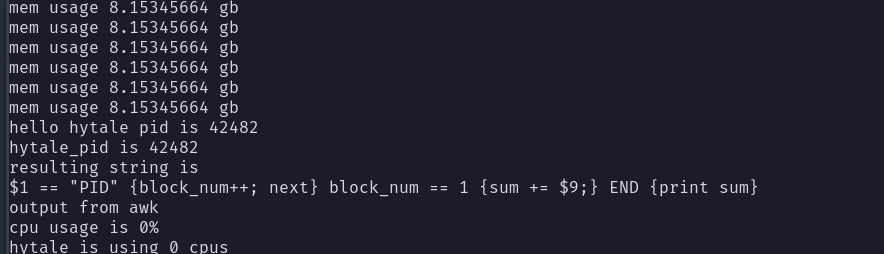

# Adamantite
Adamantite is a current work in progress.

# What it will do
Adamantite is currently a command line tool similar to htop and top. It will provide a digestable overlook on how much system resources is being consumed by Hytale and its processes.

# Why?
My reasoning for building this tool is because I wanted to learn rust. But also I host my own hytale server and at one point my server was lagging and attempting to use htop to figure out why was difficult.So I thought I wish there was a way that I could get a high level overview on how Hytale and its processes are performing on your system.

# Usage Currently
If you are interested in cloning this repo and attempting to run this program I'll go over this now.

Currently there is no binary but once you clone this repo you can do the following.

```
$ cargo run -- [OPTIONS] --system-resource <SYSTEM_RESOURCE>
```

```
Usage: adamantite [OPTIONS] --system-resource <SYSTEM_RESOURCE>

Options:
  -s, --system-resource <SYSTEM_RESOURCE>
  -t, --time-seconds <TIME_SECONDS>        [default: 1]
  -h, --help                               Print help
  -V, --version                            Print version

```
There are three system resources that you can monitor for x seconds:
- cpu
- mem
- net

These are cpu, memory, or network(as in the traffic).

If you pass in the system resource "cpu", it will print every logical core cpu% usage for x seconds.
If you pass in the system resource "mem", it will print your total memory usage on your system for x seconds.
If you pass in the system resource "net", it will print current network traffic on your system for x seconds.

These values currently have no correlation to Hytale and its logs as I'm currently working on this.

Example command:
```
$ cargo run -- -s mem -t 2
```
Output would look like this 


I cut out redundant info but it will print your mem usage for your system.
As for the other output, it will find a parent Hytale process and pass that to /bin/top which will get how much cpu% usage its using.
Currently adamantite will get the number of cpus your system has and determine how many logical cpus Hytale is using.
### Formula for this
(hytale_cpu_usage) / (100*number_of_cpus)

## What is being worked and plans for future
Say we track 5 seconds of cpu usage from Hytale and its processes.We need to follow Hytale's logs that it produces at that same time.

There is two possible routes and probably more to do this but these are what came to my mind first.

We can go the concurrency route where we instantiate two threads, one thread to get Hytales cpu usage and another thread to parse Hytale logs.

If not concurrency, I looked into using journalctl. So once we get the cpu usage for those 5 seconds we just pass arguments to journalctl to show me Hytale's logs for the last 5 seconds and parse it from there
